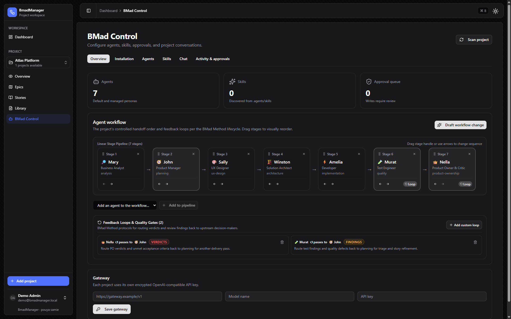

# BMad Manager

> A self-hosted command center for [BMad](https://github.com/bmad-method/bmad-method) projects—turning planning files into a clear view of delivery, progress, and controlled project operations.

BMad Manager is for teams using BMad who want to spend less time opening Markdown and YAML files to answer basic questions: *What are we building? What is in progress? What is blocked? What should happen next?* Connect a GitHub repository or a local BMad folder and get one shared workspace for epics, stories, sprint progress, documentation, and carefully reviewed operations.

## What it helps you do

- **See the whole portfolio:** compare project health, completed work, active work, and story counts from one dashboard.
- **Bootstrap projects instantly:** auto-install BMAD in new or existing local folders with a zero-typing graphical wizard and immediate agent/skill discovery.
- **Keep delivery understandable:** move from an epic to its stories and their current state without manually reconciling planning artifacts.
- **Find source material and visual assets:** browse project planning docs with rich markdown rendering, embedded screenshots, and interactive image inspection.
- **Operate local projects carefully:** use BMad Control to arrange agent workflows with visual drag-and-drop, configure feedback loops, and approve changes safely.

## See it in action

### Start with a portfolio view

The dashboard is the fastest answer to “what is happening across our BMad projects?” It shows active projects, total epics and stories, completed work, and current work in progress before you drill into an individual project.


### Understand one project at a glance

Open a project to see its sprint progress, velocity, blockers, key planning files, and epic status in one view. This is the page to use during a stand-up or delivery review.


### Follow work from epic to outcome

The epic timeline makes progress visible across the plan: completed epics, active epics, and work that has not started yet. Each epic links directly to its work items.


### Spot delivery flow on the story board

Use the story board to see which work is ready, active, blocked, or complete. Filters let a team focus on a specific epic when planning the next move.


### Keep planning files close to the work

The library provides a safe in-app browser for BMad planning and implementation artifacts, so you can read the source documents without losing the delivery context.


### Use BMad Control for reviewed local operations

BMad Control is for local projects that need a deliberate operating surface. It brings agents, skills, workflow stages, model routes, conversations, and the approval queue together; the web app previews and queues approved operations while a separate worker performs them.



## Key capabilities

- **Automatic BMAD Installation & Zero-Typing Wizard:** Import existing BMAD folders or provision new ones automatically with a graphical wizard matching the CLI (tool checkboxes, module selectors, language options, release channels).
- **Full BMad Method Agent Workflow:** Visual drag-and-drop sequencing and configurable feedback loops (e.g. Nella → John, Murat → John) with support for all core agents (Mary, John, Sally, Winston, Amelia, Murat, Nella).
- **Rich Documentation Library & Asset Viewer:** In-app markdown documentation with relative screenshot/image resolution, interactive image inspection (zoom, pan, dimensions, download), and recursive expand/collapse file tree controls.
- **Track epics, stories, sprint status, and velocity:** Automatic correlation of numeric and alphanumeric epics from single or split files.
- **Controlled Local Operations:** BMad Control operating surface with preview, approval queue, and isolated worker execution.
- **Multi-user authentication & deployment:** Role-based access, GitHub OAuth or email/password, Docker, PostgreSQL, and Traefik.

## Stack

| Area | Technology |
| --- | --- |
| Application | Next.js 16, React 19, TypeScript |
| UI | Tailwind CSS v4, shadcn/ui |
| Data | PostgreSQL, Prisma |
| Authentication | Better Auth |
| Repository access | GitHub API via Octokit |
| Testing | Vitest |
| Deployment | Docker and Traefik |

## Get started

### Use your own project locally

**Requirements:** Node.js 20+, pnpm 10+, Docker, and Docker Compose.

```bash
git clone https://github.com/pouyaSamie/Bmad-Manager.git
cd Bmad-Manager
pnpm install

# Copy .env.example to .env and fill in the required values.
docker compose up -d
pnpm db:migrate
pnpm db:create-admin --email you@example.com --password your-password --name Admin
pnpm dev
```

Open [http://localhost:3002](http://localhost:3002), sign in, then add a GitHub repository or local BMad folder. For environment variables and detailed setup, read [Getting Started](./docs/GETTING_STARTED.md).

## How to use BMad Manager

### 1. Add a BMad project

Select **Add project** in the sidebar. You can import a remote GitHub repository or choose a local folder in a self-hosted installation:
- **Existing BMAD folder:** Automatically detected and imported with immediate agent and skill discovery.
- **New or empty project folder:** BMAD Manager automatically prompts you to install BMAD with a zero-typing graphical wizard. Choose target tools/IDEs via checkboxes (Codex, Claude Code, Cursor, Copilot, Antigravity, etc.), select modules (`bmm`, `bmb`), choose languages from dropdowns, and select release channels without manual command-line typing. BMAD is installed non-interactively and configured immediately.

### 2. Start each review from the dashboard

Use the dashboard to see every imported project’s delivery state. The summary cards show project count, epics, stories, completed work, and work in progress; select a project card to investigate it.

### 3. Review delivery at the right level

- **Overview** is the project health page: sprint progress, velocity, blockers, key files, and epic status.
- **Epics** shows the plan in sequence, from completed work to upcoming outcomes.
- **Stories** provides a board or backlog view. Filter by epic when planning the next delivery slice.

### 4. Read source artifacts and inspect assets in the Docs Library

Open **Docs Library** to browse project artifacts:
- **Rich Markdown Rendering:** PRDs, architecture documents, and stories render formatted markdown with embedded screenshots and relative project image streaming (`/api/repo/.../raw`).
- **Interactive Image Viewer:** Click any image in the file tree to open the full-resolution inspection viewer with zoom in/out, pan, transparency check pattern, and direct download.
- **File Tree Controls:** Quickly navigate deep directory structures with **Expand all** and **Collapse all** toolbar buttons.

### 5. Operate and customize workflows in BMad Control

For local projects, open **BMad Control** to inspect and manage your project runtime:
- **Agent Workflow Progression:** Inspect the complete core agent team: Mary (Analyst) → John (PM) → Sally (UX) → Winston (Architect) → Amelia (Dev) → Murat (QA Advisor) → Nella (Product Owner & Design Critic).
- **Visual Reordering & Drag-and-Drop:** Visually adjust the execution sequence using intuitive grab handles and directional controls.
- **Configurable Feedback Loops:** Define review channels (e.g. Nella's PO verdicts → John for story iteration, Murat's test findings → John for triage) persisted in `_bmad/custom/workflow.toml`.
- **Safe Execution Surface:** Draft operations to preview CLI commands, approve them after review, and let the background worker (`pnpm bmad:worker`) process them safely.

### 6. Customize Agents, Skills, and Delivery Workflows

BMad Manager provides a complete, visual implementation of the official [BMad Method Customization specification](https://docs.bmad-method.org/customize/customize-bmad/):

- **Customize an Agent:** In the **Agents** tab, click **Customize** on any agent (e.g. Mary, John, Amelia, Murat, Nella) to adjust name, title, emoji icon, identity statement, communication style, principles, persistent facts, activation hooks, or menu actions. Choose between **Team Scope** (`_bmad/custom/<agent>.toml` or `_bmad/custom/config.toml`, committed to git) and **Personal Scope** (`.user.toml`, gitignored for private developer preferences).
- **Customize & Clone Skills:** Shipped vendor skills in `.agents/skills/` are protected and read-only. In the **Skills** tab, click **Clone** to create a project-owned copy in `.agents/skills/<slug>/SKILL.md` that you can freely edit, or click **New managed skill** to author custom skills from scratch.
- **Assign Skills to Agents:** Connect an agent to a specific skill directly from either interface:
  - From **Agents** → **Customize**, select any installed or cloned skill from the **Assigned Skill** dropdown.
  - From **Skills** → **Clone**, select an agent from the **Assign to agent** dropdown.
  - When creating a new agent in **New managed agent**, pick an existing skill or let BMad Manager auto-scaffold a matching portable skill.
  - This persists `skill = "<skill_name>"` in `_bmad/custom/config.toml`, ensuring the agent dispatches that skill upon activation.
- **Add Agents to the Delivery Workflow:**
  1. Open the **Overview** (Workflow) tab.
  2. In the **Add an agent to the workflow…** selector, choose any candidate, customized, or newly created agent and click **Add to pipeline**.
  3. Drag and drop the agent card (or use the arrow buttons) to reposition it anywhere in the delivery progression (e.g. placing a Security Reviewer between Dev and QA).
  4. Configure feedback loops (e.g. routing QA findings or critic verdicts to the PM or custom agent).
  5. Click **Save Workflow Sequence & Loops**, review the drafted changes in **Activity & approvals**, and approve. The background worker writes `_bmad/custom/workflow.toml`.

### Run the BMad Control worker

BMad Control is available for imported local projects. It uses encrypted gateway credentials and a dedicated worker, so the web application does not execute queued operations itself.

Add a stable 32-byte base64url `AGENT_ENCRYPTION_KEY` to `.env`, then run the application and worker in separate terminals:

```bash
pnpm dev
pnpm bmad:worker
```

Operations are previewed before approval, limited to allowlisted project actions, and recorded with redacted output. Read the [BMad Control guide](./docs/BMAD_CONTROL.md) before enabling it.

## Development commands

```bash
pnpm dev              # Start the development server on port 3002
pnpm build            # Create a production build
pnpm start            # Run the production server
pnpm lint             # Run ESLint
pnpm test             # Run the Vitest suite
pnpm test:watch       # Run Vitest in watch mode
pnpm db:generate      # Generate the Prisma client
pnpm db:migrate       # Create and apply a development migration
pnpm db:push          # Push the schema without creating a migration
pnpm db:studio        # Open Prisma Studio
pnpm db:create-admin  # Create an administrator account
pnpm bmad:worker      # Process approved BMad Control operations
```

## BMad project conventions

BMad Manager supports numeric and alphanumeric epic identifiers.

| Artifact | Example | Detected ID |
| --- | --- | --- |
| Epic heading | `## Epic 1: Foundation` | `1` |
| Epic heading | `## Epic DevOps/Infra: Pipeline` | `devops-infra` |
| Epic file | `planning-artifacts/epics/epic-housekeeping.md` | `housekeeping` |
| Story file | `implementation-artifacts/1-2-setup.md` | `1.2` |
| Story file | `implementation-artifacts/DI-1-pipeline.md` | `di.1` |

For alphanumeric epic headings, use the `Epic` keyword so ordinary headings are not mistakenly treated as epics.

## Deploying

The included production setup runs the application, PostgreSQL, and Traefik with automatic TLS. Follow the [production deployment guide](./docker/DEPLOY.md) for the required environment variables and commands.

## Documentation

- [Getting Started](./docs/GETTING_STARTED.md) — local setup and configuration
- [Local Folder Import](./docs/LOCAL_FOLDER.md) — importing projects from the filesystem
- [BMad Control](./docs/BMAD_CONTROL.md) — controlled local-project operations
- [API Reference](./docs/API.md) — health and cache-revalidation endpoints

## License

Distributed under the [MIT License](./LICENSE).
