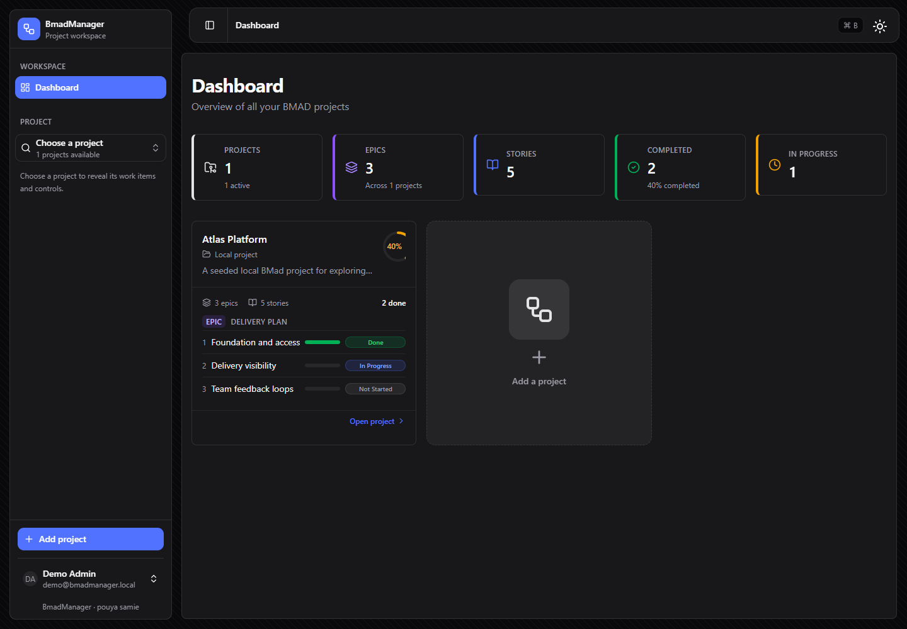
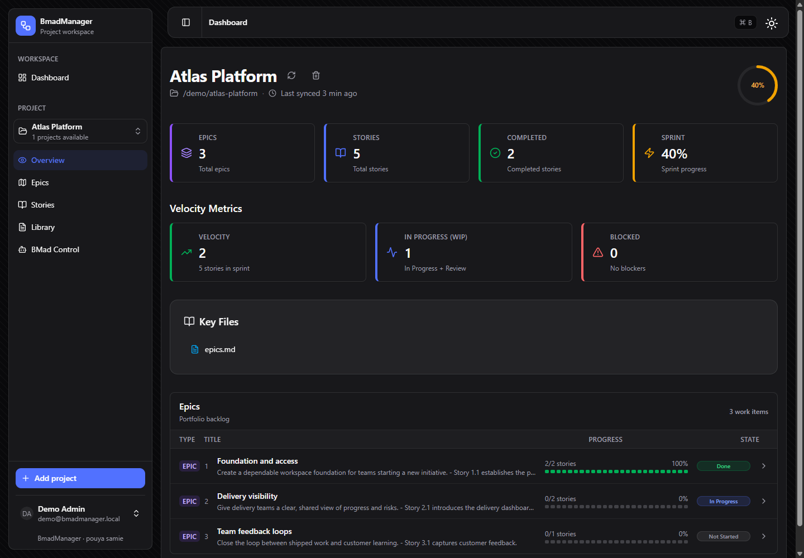
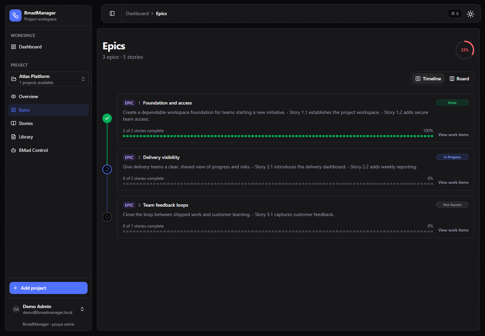
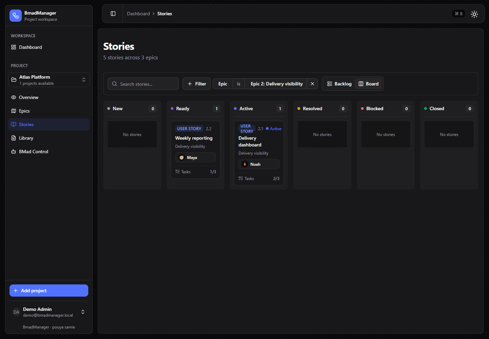
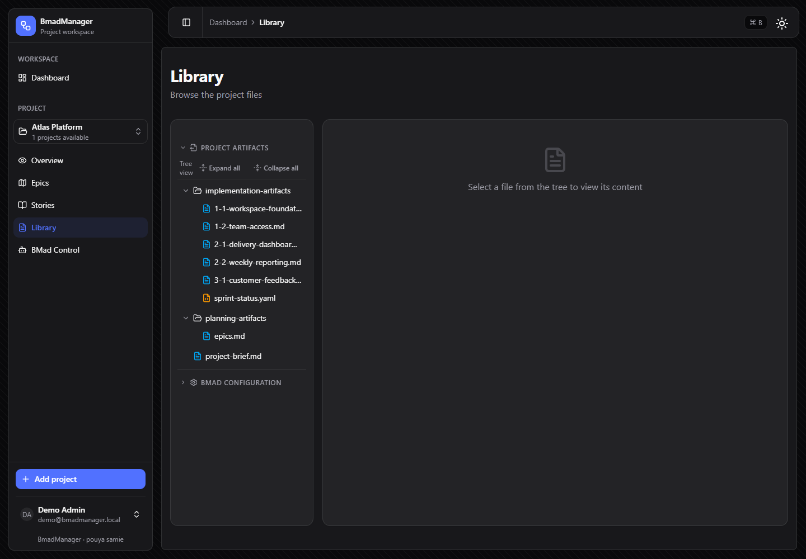

# Bmad Manager

> A self-hosted workspace for understanding, tracking, and safely operating [BMad](https://github.com/bmad-method/bmad-method) projects.

Bmad Manager turns the planning artifacts already in a BMad project into a practical dashboard. Connect a GitHub repository or a local folder to see epics, stories, sprint progress, and documentation in one place. For local projects, the built-in BMad Control area can discover installed agents and skills, then queue approved, allowlisted maintenance operations for a separate worker.



## Highlights

- Import BMad projects from GitHub or, in self-hosted environments, directly from local folders.
- Track epics, stories, sprint status, velocity, and supporting planning documents.
- Read both a single `epics.md` file and split epic files in an `epics/` directory.
- Browse BMad documentation without leaving the dashboard.
- Manage branch selection per repository.
- Authenticate with email/password, with optional GitHub OAuth.
- Run multi-user installations with user roles.
- Use **BMad Control** for local projects to discover agents and skills, review changes, and process approved operations through a dedicated worker.
- Deploy with Docker, PostgreSQL, and Traefik.

## Screenshots

| Project overview | Epic tracking |
| --- | --- |
|  |  |

| Story board | Documentation browser |
| --- | --- |
|  |  |

## Stack

| Area | Technology |
| --- | --- |
| Application | Next.js 16, React 19, TypeScript |
| UI | Tailwind CSS v4, shadcn/ui |
| Data | PostgreSQL, Prisma |
| Authentication | Better Auth |
| Repository access | GitHub API via Octokit |
| Testing | Vitest |
| Deployment | Docker and Traefik |

## Quick start

### Requirements

- Node.js 20 or later
- pnpm 9 or later
- Docker and Docker Compose (for the included PostgreSQL service)

### Run locally

```bash
git clone https://github.com/pouyaSamie/Bmad-Manager.git
cd Bmad-Manager
pnpm install

# Copy .env.example to .env and fill in the required values.
docker compose up -d
pnpm db:migrate
pnpm db:create-admin --email you@example.com --password your-password --name Admin
pnpm dev
```

Open [http://localhost:3002](http://localhost:3002), sign in, and add a GitHub repository or local BMad folder.

For a full description of the environment variables, see [Getting Started](./docs/GETTING_STARTED.md).

### BMad Control worker

BMad Control is available for imported local projects. It uses encrypted gateway credentials and a dedicated worker, so the web application does not execute queued operations itself.

Add a stable 32-byte base64url `AGENT_ENCRYPTION_KEY` to `.env`, then run the application and worker in separate terminals:

```bash
pnpm dev
pnpm bmad:worker
```

Operations are previewed before approval, limited to allowlisted project actions, and recorded with redacted output. Read the [BMad Control guide](./docs/BMAD_CONTROL.md) before enabling it.

## Development commands

```bash
pnpm dev              # Start the development server on port 3002
pnpm build            # Create a production build
pnpm start            # Run the production server
pnpm lint             # Run ESLint
pnpm test             # Run the Vitest suite
pnpm test:watch       # Run Vitest in watch mode
pnpm db:generate      # Generate the Prisma client
pnpm db:migrate       # Create and apply a development migration
pnpm db:push          # Push the schema without creating a migration
pnpm db:studio        # Open Prisma Studio
pnpm db:create-admin  # Create an administrator account
pnpm bmad:worker      # Process approved BMad Control operations
```

## BMad project conventions

Bmad Manager supports numeric and alphanumeric epic identifiers.

| Artifact | Example | Detected ID |
| --- | --- | --- |
| Epic heading | `## Epic 1: Foundation` | `1` |
| Epic heading | `## Epic DevOps/Infra: Pipeline` | `devops-infra` |
| Epic file | `planning-artifacts/epics/epic-housekeeping.md` | `housekeeping` |
| Story file | `implementation-artifacts/1-2-setup.md` | `1.2` |
| Story file | `implementation-artifacts/DI-1-pipeline.md` | `di.1` |

For alphanumeric epic headings, use the `Epic` keyword so ordinary headings are not mistakenly treated as epics.

## Deploying

The included production setup runs the application, PostgreSQL, and Traefik with automatic TLS. Follow the [production deployment guide](./docker/DEPLOY.md) for the required environment variables and commands.

## Documentation

- [Getting Started](./docs/GETTING_STARTED.md) — local setup and configuration
- [Local Folder Import](./docs/LOCAL_FOLDER.md) — importing projects from the filesystem
- [BMad Control](./docs/BMAD_CONTROL.md) — controlled local-project operations
- [API Reference](./docs/API.md) — health and cache-revalidation endpoints
- [Contributing](./CONTRIBUTING.md) — contribution guidelines
- [Security](./SECURITY.md) — responsible disclosure policy

## Contributing

Issues and pull requests are welcome. Please read [CONTRIBUTING.md](./CONTRIBUTING.md) before opening a pull request.

## License

Distributed under the [MIT License](./LICENSE).
